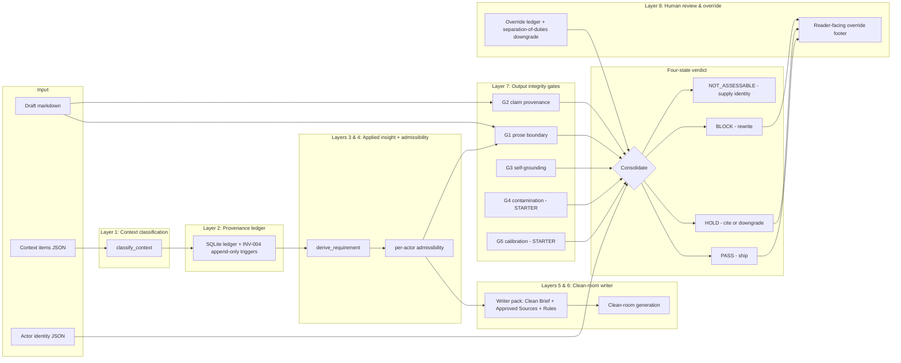

# WarrantOS Stack

WarrantOS is the product frame for a set of controls that make AI-assisted
work auditable before it becomes reader-facing output. The current
`claude-provenance` repository is the stdlib-first reference implementation
of the WarrantOS architecture; it is a working subset of the full
specification, not the full operating system.

## Architecture diagram

Reading the diagram: context flows top-to-bottom through classification,
admissibility, and the writer pack; the draft and the writer's output flow
through the five output integrity gates; the eight verdict signals consolidate
into one of four states; the override ledger sits beside the verdict layer so
human authority is recorded as structured evidence, not free text. `NOT_BUILT`
foundation rows (Data Classification, Retention/Tombstones) wrap the whole
stack and are documented as adopter-supplied; they do not appear in the
runtime path.

For the per-layer build state at the current version, see
[`STATUS.md`](STATUS.md). For the layer-to-module mapping table, see
[`OVERVIEW.md`](OVERVIEW.md).

## Working subset shipped today

The repository implements the warrant gates whose mechanics are stable:

- Provenance Ledger: record claim checks, outcomes, and epistemic debt.
- Context Admissibility: decide which pieces of process context may influence
  the answer, and how.
- BriefLock: hold a final artefact at the boundary until citation and context
  gates pass.
- Context Bill of Materials (CBOM): summarise which context entered the
  workflow, how it was classified, and which transformations were allowed.
- Prose Boundary Gate: block process narration from leaking into final prose.
- Multi-Agent Review: use separate agents or passes for generation,
  verification, adversarial review, and release judgement.

The stack is a governance pattern first and an implementation second. The
repo currently implements parts of the pattern for Claude Code and CLI
workflows. It should not be described as a general benchmark winner, a full
entailment engine, or a complete compliance product.

## Layer 1: Claim Provenance

The original Provenance Ledger remains the base layer. It extracts factual
claims, binds nearby sources, verifies cited material when requested, applies
`report` or `enforce` policy, and writes results to a SQLite ledger.

Implemented surfaces:

- `hooks/provenance_check.py` for Claude Code hook checks.
- `cli/provenance_cli.py` for file, directory, stdin, CI, and JSON runs.
- `provenance/ledger.py` for durable records and evidence-matrix export.
- `docs/PROVENANCE-LOOP.md` for the Extract, Bind, Verify, Adjudicate,
  Ledger pattern.

Current limits:

- Detection is heuristic.
- Offline verification is token-overlap based.
- Online verification depends on reachable sources and grader quality.
- The corpora are regression and illustration seeds, not validated
  benchmarks.

## Layer 2: Context Admissibility

Context Admissibility handles material that is not a source citation but can
still shape output: user feedback, prior drafts, tool traces, style signals,
operator notes, and private reasoning. The question is not "is this true";
the question is "may this context influence the final artefact, and may it
appear in final prose".

Implemented surfaces in the current working tree:

- `provenance/context_admissibility.py` classifies context items.
- `derive_requirement()` transforms admissible context into instructions.
- `scan_prose_boundary()` detects process-to-prose leakage.
- `compile_cbom()` emits a CBOM-style report.
- `cli/provenance_cli.py --cbom --context PATH` runs the boundary gate.

This layer is currently rule-based. It is deliberately transparent and
conservative, not a semantic classifier.

## Layer 3: BriefLock

BriefLock is the release posture: a brief, paper, policy note, or client-ready
artefact should not be treated as final until the relevant gates have run.

In the present repo, BriefLock is a framing over existing mechanics rather
than a separate product module:

- provenance CLI in CI mode can fail on unsupported or contradicted claims;
- CBOM mode can fail on process leakage;
- ledger exports can support human release review.

A full BriefLock product would add explicit release manifests, configured
gate profiles by artefact type, reviewer sign-off, and packaged evidence
bundles. Those pieces are not yet implemented here.

## Layer 4: CBOM

A Context Bill of Materials is the context equivalent of a software bill of
materials. It records the inputs that shaped an artefact without exposing raw
private reasoning or treating every process note as final-prose material.

The current CBOM schema is intentionally small:

- summary counts;
- per-item admissibility summaries;
- allowed transformations;
- prose-boundary verdict and violations.

This is enough to support local review and CI checks. It is not yet a stable
external standard.

## Layer 5: Multi-Agent Review

WarrantOS assumes that important artefacts should not rely on a single model
pass. A practical workflow separates roles:

- Writer: produces the draft.
- Provenance checker: detects and verifies factual claims.
- Context reviewer: checks whether process context was transformed properly.
- Adversarial reviewer: looks for unsupported, misleading, or leaked material.
- Release owner: decides whether the artefact is ready to ship.

The repository supports parts of this through CLI and hook entrypoints. It
does not yet orchestrate agents or enforce reviewer separation by itself.

## Product Positioning

Use this wording:

> WarrantOS is a warrant layer for AI-assisted work. The current
> `claude-provenance` implementation records claim provenance, checks source
> support, and adds early context-admissibility gates for final prose.

Avoid this wording:

> WarrantOS guarantees factual accuracy.

> WarrantOS is a complete compliance platform.

> WarrantOS has benchmark-proven superiority over other verification systems.

The honest claim is stronger: WarrantOS makes unsupported claims and process
leakage visible, reviewable, and gateable.
